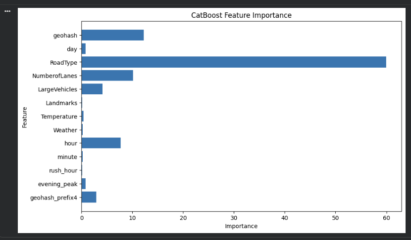

# Traffic Demand Prediction using CatBoost

## Overview

This project focuses on forecasting urban traffic demand using machine learning techniques on spatio-temporal, environmental, and road-network data.

The objective is to predict traffic demand at different locations and timestamps to support transportation planning, congestion management, and data-driven mobility solutions.

---

## Results

### Model Performance

| Metric                               | Score       |
| ------------------------------------ | ----------- |
| Validation R² Score                  | **0.9436**  |
| Hackerearth Public Leaderboard Score | **90.8044** |

### Final Model

**CatBoost Regressor**

* Iterations: 2000
* Depth: 8
* Learning Rate: 0.03

---

## Project Outputs

### Validation Performance


### Feature Importance



---

## Dataset

### Dataset Size

* Training Samples: 77,299
* Test Samples: 41,778

### Features

* Geohash
* Day
* Timestamp
* RoadType
* NumberofLanes
* LargeVehicles
* Landmarks
* Temperature
* Weather

### Target Variable

* Demand

---

## Exploratory Data Analysis (EDA)

Performed comprehensive analysis including:

* Missing value analysis
* Demand distribution analysis
* Weather-wise demand analysis
* Road type analysis
* Lane count analysis
* Geospatial feature analysis

---

## Feature Engineering

Created additional predictive features to improve model performance:

* Hour extraction from timestamp
* Minute extraction from timestamp
* Rush Hour indicator
* Evening Peak indicator
* Geohash Prefix encoding
* Traffic pattern-based temporal features

---

## Model Development

### Algorithm

CatBoost Regressor

### Why CatBoost?

* Handles categorical variables efficiently
* Requires minimal preprocessing
* Robust against overfitting
* Strong performance on tabular datasets

### Hyperparameters

```python
iterations = 2000
depth = 8
learning_rate = 0.03
loss_function = "RMSE"
```

---

## Tech Stack

* Python
* Pandas
* NumPy
* Scikit-Learn
* CatBoost
* Matplotlib
* Jupyter Notebook

---

## Key Learnings

* Feature engineering for spatio-temporal datasets
* Geospatial feature extraction using Geohash
* Traffic demand forecasting using machine learning
* Handling categorical variables with CatBoost
* Model evaluation using R² Score
* Feature importance interpretation
* End-to-end machine learning workflow development

---

## Repository Structure

```text
traffic-demand-prediction/
│
├── Traffic_Demand_Prediction_CatBoost.ipynb
├── README.md
├── requirements.txt
└── images/
    ├── validation_score.png
    ├── feature_importance.png
    └── leaderboard_score.png
```
